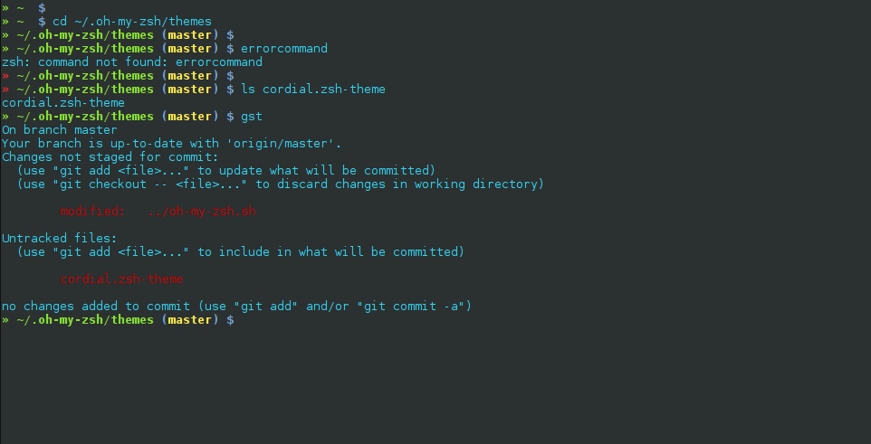

# Cordial » A zsh theme

[Installation instructions](https://github.com/robbyrussell/oh-my-zsh/wiki/Customization#overriding-and-adding-themes)

## License

To the extent possible under law, [Steve Lacy](http://slacy.me) has waived all copyright and related or neighboring rights to this work.
